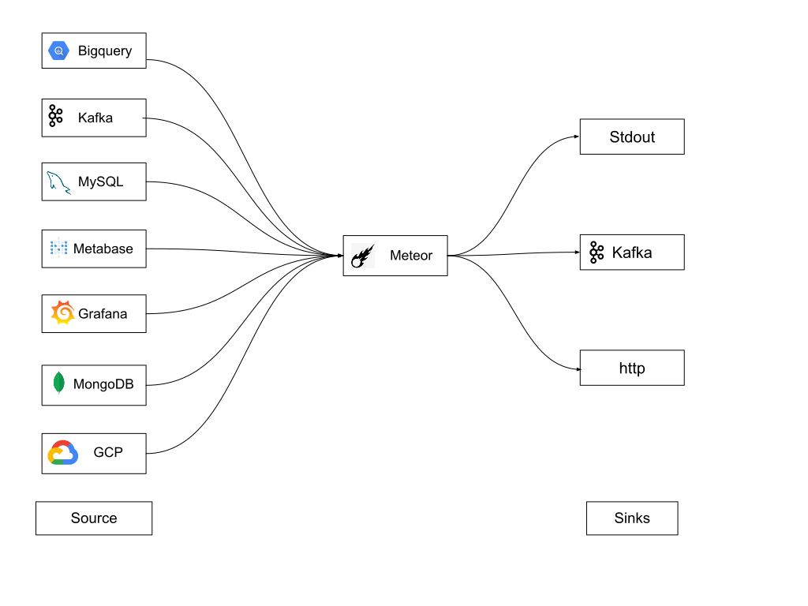

# Meteor


[](LICENSE)
[](Version)

Meteor is a plugin driven agent for collecting metadata. Meteor has plugins to source metadata from a variety of data stores, services and message queues. It also has sink plugins to send metadata to variety of third party APIs and catalog services.

<p align="center"></p>

## Key Features

* **No Dependency:** Written in Go. It compiles into a single binary with no external dependency.
* **Extensible:** Plugin system allows new sources and sinks to be easily added.
* **Ecosystem:** Extract metadata for many popular services with a wide number of service plugins.
* **Customizable:** Add your own processors and sinks to suit your many use cases.
* **Runtime:** Meteor can run inside VMs or containers with minimal memory footprint.

## Documentation

Explore the following resources to get started with Meteor:

* [Usage Guides](https://odpf.gitbook.io/meteor/guides/usage) will help you get started on Meteor.
* [Concepts](https://odpf.gitbook.io/meteor/concepts/overview) describes all important Meteor concepts.
* [Contribute](https://odpf.gitbook.io/meteor/contribute/contributing) contains resources for anyone who wants to contribute to Meteor.

## Installation 

`meteor` is available via Homebrew and as a downloadable binary from the [releases](https://github.com/odpf/meteor/releases) page.

**Homebrew**
```sh
# install meteor (requires homebrew installed)
$ brew install odpf/taps/meteor

# upgrade meteor (requires homebrew installed)
$ brew upgrade meteor

# check for meteor installation
$ meteor --help
```

## Running locally

```sh
# Clone the repo
$ git clone https://github.com/odpf/meteor.git

# Install all the golang dependencies
$ go mod tidy

# Build meteor binary file
$ make build

# Run meteor on a recipe file
$ ./meteor run sample-recipe.yaml

# Run meteor on multiple recipes in a directory
$ ./meteor run directory-path
```

## Running tests

```sh
# Running all unit tests, excluding extractors
$ make test

# Run integration test for any extractor
$ cd plugins/extractors/<name-of-extractor>
$ go test -tags=integration
```

## Contribute

Development of Meteor happens in the open on GitHub, and we are grateful to the community for contributing bugfixes and improvements. Read below to learn how you can take part in improving Meteor.

Read our [contributing guide](docs/contribute/contributing.md) to learn about our development process, how to propose bugfixes and improvements, and how to build and test your changes to Meteor.

To help you get your feet wet and get you familiar with our contribution process, we have a list of [good first issues](https://github.com/odpf/meteor/labels/good%20first%20issue) that contain bugs which have a relatively limited scope. This is a great place to get started.

This project exists thanks to all the [contributors](https://github.com/odpf/meteor/graphs/contributors).

## License

Meteor is [Apache 2.0](LICENSE) licensed.
